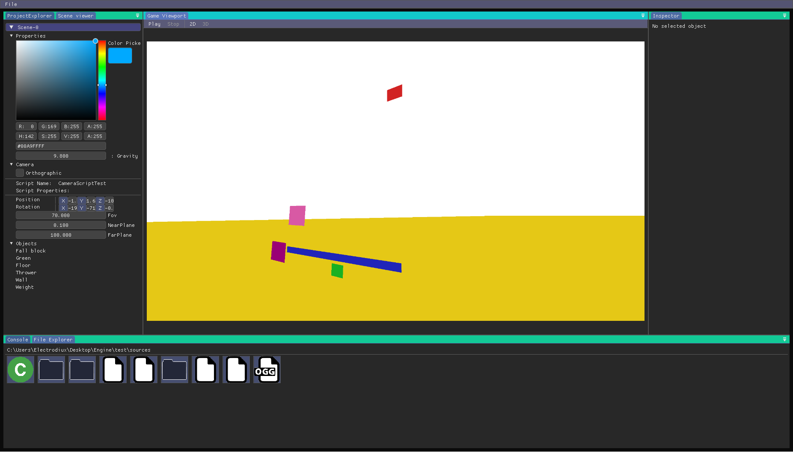

# Java Game Engine

> **Note**: This project was created when I was 14-15 years old as a learning exercise and personal challenge. It serves as a showcase of my early programming journey and is not actively maintained. The code represents my skills and understanding at that time.



## About This Project

Java Game Engine is a 2D/3D game engine written in Java, developed as a personal project during my teenage years. This was an ambitious undertaking that taught me fundamental concepts in game development, graphics programming, and software architecture.

### What I Learned Building This Engine

- **Graphics Programming**: OpenGL rendering, shaders, framebuffers
- **Game Architecture**: Entity-component systems, scene management
- **GUI Development**: ImGui integration for editor interfaces
- **Physics**: Basic physics simulation and collision detection
- **Audio**: Sound system integration
- **Scripting**: Custom scripting language support
- **Project Management**: Organizing a large codebase with multiple subsystems

## Features

### 🎮 Core Engine

- **OpenGL Rendering**: Hardware-accelerated 2D and 3D graphics
- **Scene Management**: Hierarchical scene structure with component system
- **Asset Management**: Texture, audio, and resource loading
- **Input Handling**: Keyboard and mouse input processing
- **Multi-language Support**: Internationalization system

### 🛠️ Editor Tools

- **Visual Editor**: ImGui-based scene editor with viewport
- **File Explorer**: Built-in project file management
- **Debug Tools**: Performance profiling and debug visualization
- **Property Inspector**: Real-time component editing

### 🔧 Technical Features

- **Custom Scripting**: Game logic scripting system
- **Physics Engine**: Collision detection and physics simulation
- **Audio System**: Multi-channel audio playback
- **Account System**: User authentication and session management
- **HTTP Client**: Network communication capabilities

## Technical Stack

- **Language**: Java 8+
- **Graphics**: LWJGL (OpenGL binding)
- **GUI**: Dear ImGui (Java binding)
- **Physics**: jbox2d and jbullet
- **Audio**: OpenAL through LWJGL
- **Networking**: Apache HttpClient
- **JSON**: Simple JSON parser
- **Math**: JOML (Java OpenGL Math Library)

## Building and Running

### Prerequisites

- Java 8 or higher
- All required JARs are included in the `lib/` directory

### Compilation

Use the provided compilation script:

```bash
./compile.sh
```

## Libraries Used

This project depends on several external libraries:

- **LWJGL**: OpenGL, GLFW, OpenAL bindings
- **ImGui**: Immediate mode GUI
- **Apache HttpClient**: HTTP communication
- **GSON**: JSON processing
- **JNA**: Native library access
- **JOML**: OpenGL mathematics

## Reflection

Looking back at this project, I'm proud of what I accomplished at such a young age. While the code may not follow all modern best practices, it represents genuine learning and problem-solving. Building a game engine from scratch taught me:

- The importance of modular architecture
- Graphics programming fundamentals
- Resource management techniques
- The complexity of real-time systems
- Project organization and dependency management

This project sparked my passion for graphics programming and low-level systems development that continues to this day.

## Archive Notice

This project is preserved as-is for historical and portfolio purposes. It demonstrates my early programming abilities and serves as a milestone in my development journey. The code is not maintained and may not compile or run on modern systems without modifications.

---

_Created by Pablo Bermejo Hernández 🚀_
